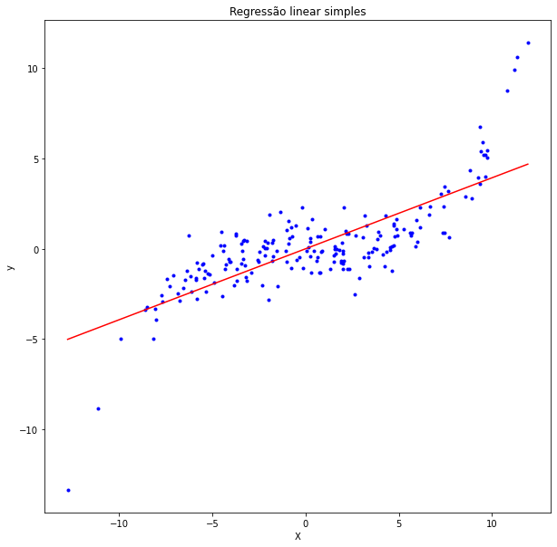
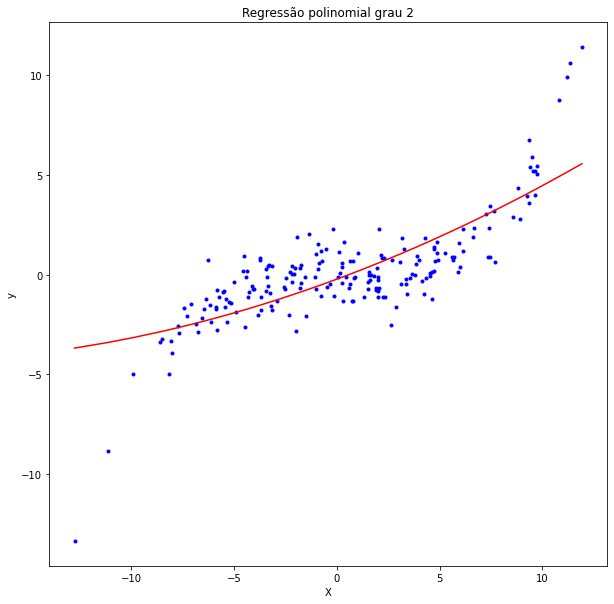
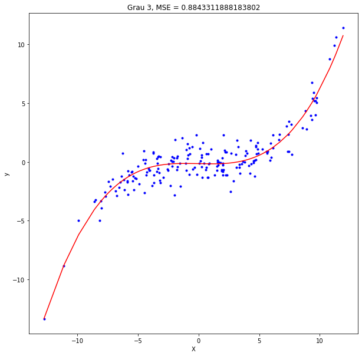

# Descrição do repositório

Este repositório armazena um notebook sobre Regressão Polinomial (simples e múltipla) e Regularização, contendo um estudo sobre esse tema desenvolvido no âmbito do grupo CiDAMO, com a orientação do Profº Lucas Pedroso. O notebook contém:

```
1 Introdução
2 O problema da regressão polinomial
3 Regressão polinomial simples
4 Regressão polinomial múltipla
5 Usando um encoding ordinal manual
6 Regressão polinomial com regularização
  6.1 O que é a regularização?
  6.2 Para que serve a regularização?
    6.2.1 Reduzir o overfitting do modelo
  6.3 Regularização Ridge (L2)
  6.4 Regularização Lasso (L1)
  6.5 Regularização Elastic Net
7 Próximos passos mapeados
```

# Ilustração da regressão polinomial

Lembremos que, dado um conjunto de pontos, uma regressão linear (simples) encontra a reta que melhor se ajusta aos pontos, da seguinte forma:



Mas note que a reta não descreve bem o conjunto de dados. Que tal se tentássemos fazer isso com um polinômio? É aí que entra a regressão polinomial. No mesmo conjunto de dados do exemplo anterior, esse é o polinômio de grau 2 que melhor se ajusta aos dados:



Como ainda está ruim, vamos aumentar o grau do polinômio para 3:



Agora sim! Visualmente o polinômio está bem ajustado ao conjunto de dados. Mas e se tivermos mais variáveis preditoras e não for possível visualizar? Como escolher o melhor grau do polinômio? Como avaliar o modelo e evitar overfitting, dentre outras coisas?

Este notebook visa responder todas essas perguntas, com a explicação e aplicação da regressão polinomial, além do uso da regularização para evitar o everfitting desse modelo.
